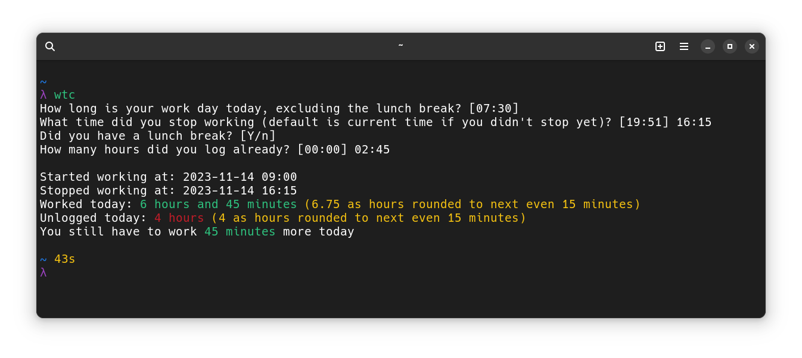

= Work time calculator

An interactive CLI tool to calculate work time.

== Install

You can run this in your terminal

[,shell]
----
npm i -g work-time-calculator
----

If you get a permission denied error, you can run the previous command
with sudo (**not recommended**), or you can set a local prefix to npm.
Feel free to create the prefix wherever you like, this is just a
location I decided to use. The only requirement is that the location
needs to be readable and writable by your user.

[,shell]
----
npm config set prefix '~/.local/share/npm'
----

After that you can run the installation again. Running the program
requires that you have your npm prefix in your `$PATH`. You can find
an example of this in my https://git.korhonen.cc/FunctionalHacker/dotfiles/src/commit/4442252c659179d860d71982a6b705dcecc54ea6/home/.config/zsh/02-env.zsh#L31-L32[dotfiles]. This configuration file is for ZSH but should also work for bash.

After installation, you should be able to run the program with

[,shell]
----
wtc
----

== Update

To update, just run the install command again

== Rationale

Don't know if it's just me but calculating my working hours sometimes
can get difficult. Especially if you have flexible hours and you end up
starting at a weird time, f.ex 08:15. This combined with the fact that
I have to log my hours to many different tasks, at the end of the day
calculating all this can get very confusing.

To alleviate my pains, I included the following features

* Asks wether you already had lunch or not and accommodates this in the calculation
* Asks the hours that you already logged and calculates unlogged hours
* Calculates how much under/overtime you worked

This is a highly opinionated tool I built for my specific needs.
There probably exists other tools to do the same task
(maybe even better) but I wanted something simple that fits for my
needs specifically.

== Configuration file

See the https://git.korhonen.cc/FunctionalHacker/work-time-calculator/src/branch/main/config/config.toml[default configuration file]
for more information on how to override configurations.

== TODO

* [x] Configuration file for default settings and altering behaviour in interactive mode
* [ ] Non-interactive mode with CLI arguments parsing
